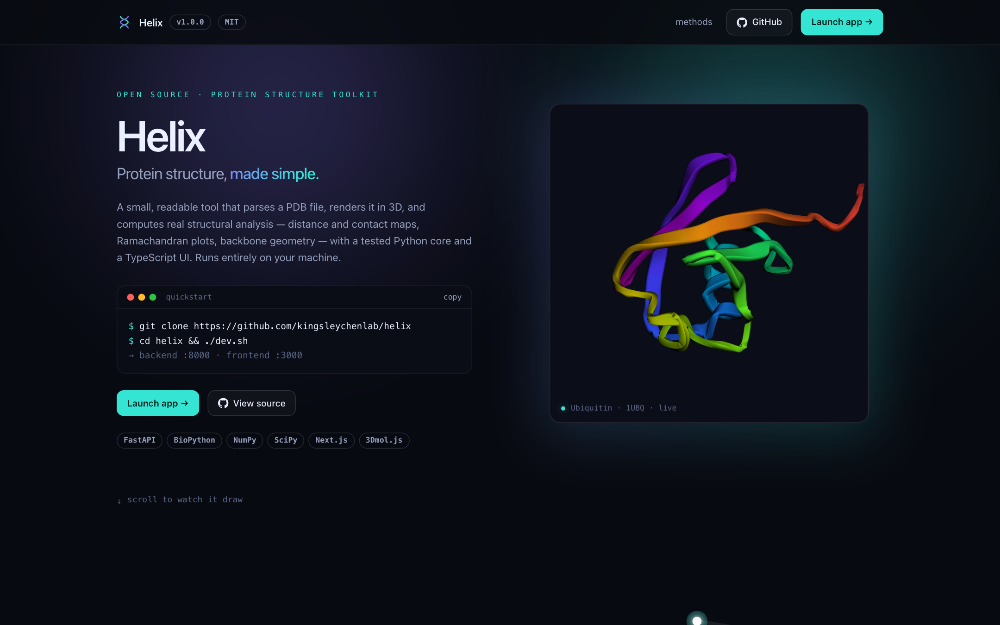
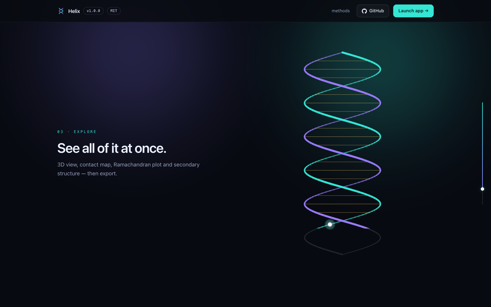
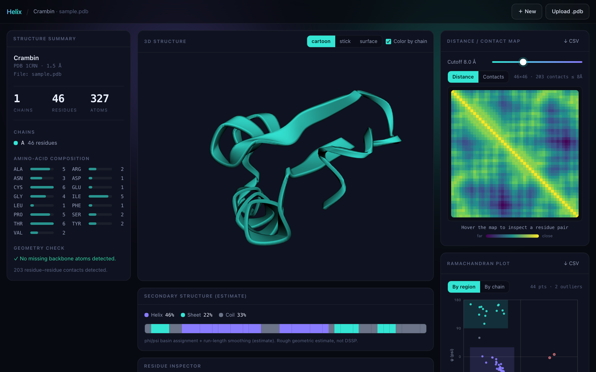
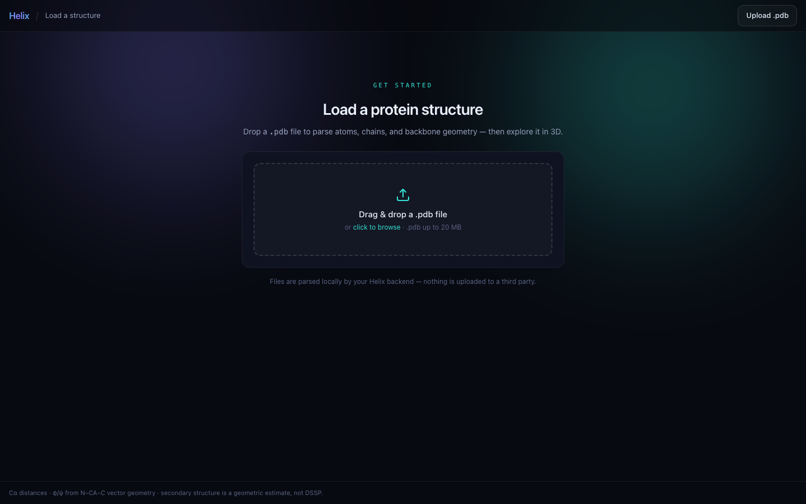

<div align="center">

# Helix

**Protein structure analysis made simple.**

Helix turns a raw PDB file into clear 3D visuals and quantitative reports —
residue distance maps, Ramachandran plots, backbone angles, contact maps, and a
geometric secondary-structure estimate — using real biochemical math.

</div>

> **Portfolio summary.** Helix is a protein-structure analysis tool that turns
> raw PDB files into interactive 3D views, contact maps, Ramachandran plots,
> residue-level inspection, and exportable reports. It combines computational
> biology, geometry, and clean scientific UI design.

---

## What is Helix?

Protein structures are hard to read from raw PDB files. Coordinates alone don't
tell you which residues are in contact, whether the backbone geometry is
reasonable, or where the helices and sheets are. Helix parses a structure,
renders it in 3D, and computes a set of standard structural analyses that are
common in computational biology — each one derived from first principles and
exposed through a clean, minimal interface.

It is built as a small, honest full-stack tool: a modular, tested Python backend
that does the science, and a TypeScript/Next.js frontend that makes it usable.

## Why protein structure analysis matters

The three-dimensional shape of a protein determines its function. Distance and
contact maps reveal the fold's topology and long-range interactions;
Ramachandran plots validate backbone geometry and flag strained conformations;
secondary-structure content summarizes the fold at a glance. These analyses
underpin structure validation, comparative modeling, docking, and machine
learning on proteins (contact maps and dihedral features are common model
inputs). Helix implements the core primitives that all of these build on.

## Features

- **Landing page** — what the tool does, one click into the dashboard.
- **Upload or sample** — drop in any `.pdb`, or start instantly with three
  bundled real structures (Crambin, Ubiquitin, Trp-cage). Robust parsing of
  atoms, residues, chains, coordinates, and backbone atoms with error handling.
- **3D viewer** (3Dmol.js) — cartoon / stick / surface styles, per-chain
  coloring, rotate / zoom / pan, and click-to-select any residue.
- **Structure summary** — name, chains, residue and atom counts, amino-acid
  composition, chain lengths, and detection of missing backbone atoms.
- **Distance / contact map** — pairwise Cα distance matrix and a contact map at
  an adjustable cutoff (default 8 Å), shown as a heatmap, exportable as CSV.
- **Ramachandran plot** — backbone φ/ψ dihedrals with allowed-region shading,
  coloring by region or chain, simple outlier flagging, and CSV export.
- **Secondary-structure estimate** — an explainable helix / sheet / coil
  assignment from backbone geometry (clearly labeled as an estimate, not DSSP).
- **Residue inspector** — for any selected residue: name, index, chain,
  coordinates, neighbors within 8 Å, φ/ψ angles, and its structure state.
- **Downloadable report** — a single ZIP with a summary, amino-acid composition,
  contact-map stats, the Ramachandran angle table, geometry warnings, and
  rendered plots (PNG).

## Tech stack

| Layer     | Tools |
|-----------|-------|
| Backend   | Python · FastAPI · BioPython · NumPy · pandas · SciPy · matplotlib |
| Frontend  | Next.js (App Router) · TypeScript · Tailwind CSS · 3Dmol.js · Framer Motion |
| Testing   | pytest |

## Project structure

```
Helix/
├── backend/
│   ├── app/
│   │   ├── geometry.py     # pure math: distances, dihedrals, matrices
│   │   ├── parsing.py      # BioPython -> typed dataclasses
│   │   ├── analysis.py     # summary, distance/contact maps, φ/ψ
│   │   ├── secondary.py    # geometric secondary-structure estimate
│   │   ├── report.py       # matplotlib plots + ZIP report
│   │   ├── samples.py      # bundled sample proteins
│   │   ├── service.py      # in-memory structure store
│   │   └── main.py         # FastAPI endpoints
│   ├── samples/            # 1CRN, 1UBQ, 1L2Y (real PDB files)
│   └── tests/              # parsing, geometry, analysis tests
└── frontend/
    ├── app/                # landing + dashboard (App Router)
    ├── components/         # Viewer, ContactMap, Ramachandran, ...
    └── lib/                # typed API client + shared types
```

## Setup

### Quick start (both servers)

```bash
./dev.sh
```

Then open **http://localhost:3000**. The script creates the Python venv,
installs dependencies on first run, and starts both servers.

### Manual setup

**Backend** (http://127.0.0.1:8000):

```bash
cd backend
python3 -m venv .venv
source .venv/bin/activate
pip install -r requirements.txt
uvicorn app.main:app --reload --port 8000
```

**Frontend** (http://127.0.0.1:3000):

```bash
cd frontend
npm install
npm run dev          # or: npm run build && npm run start
```

The frontend talks to the backend at `http://127.0.0.1:8000` by default; override
with `NEXT_PUBLIC_API_URL` (see `frontend/.env.local.example`).

### Tests

```bash
cd backend
./.venv/bin/python -m pytest        # 33 tests: parsing, geometry, analysis, API
```

## Using Helix

Open **http://localhost:3000** and click **Launch app** to reach the dashboard.

**Upload a PDB file.** On the dashboard's start screen, drag a `.pdb` file onto
the drop zone or click to browse. The file is parsed by your local backend; the
original file name is shown in the header and summary. Non-`.pdb` files, empty
files, and malformed structures are rejected with a clear message and never
crash the app. Helix is bring-your-own-data — nothing is sent to a third party.

Once a structure is loaded, the dashboard shows the 3D view,
structure summary, contact map, Ramachandran plot, secondary-structure track,
and residue inspector. Use the cutoff slider to recompute contacts live, click a
residue in the 3D view / plot / track to inspect it, and use the CSV / report
buttons to export.

## Mathematical methods

All analyses skip missing atoms safely rather than crashing.

**Residue distances.** For residues *i* and *j* with Cα positions
**cᵢ**, **cⱼ**, the distance is the Euclidean norm
`dᵢⱼ = ‖cᵢ − cⱼ‖₂`. The full distance matrix is computed by broadcasting the
`(N, 3)` coordinate array against itself, giving a symmetric `(N, N)` matrix with
a zero diagonal.

**Contact map.** Residues *i* and *j* are in contact when `dᵢⱼ ≤ cutoff`
(default 8 Å); self-contacts on the diagonal are excluded. The unique contact
count is the number of `True` entries in the upper triangle.

**Backbone dihedrals (φ/ψ).** For residue *i*:

```
φ(i) = dihedral( C(i−1), N(i),  Cα(i), C(i)  )
ψ(i) = dihedral( N(i),   Cα(i), C(i),  N(i+1))
```

The dihedral of four points **p₀, p₁, p₂, p₃** is computed with the numerically
stable cross-product / `atan2` formulation. With bond vectors
**b₀ = p₀ − p₁**, **b₁ = p₂ − p₁**, **b₂ = p₃ − p₂**, we project **b₀** and
**b₂** onto the plane perpendicular to **b₁** and take:

```
x = v · w
y = (b₁ × v) · w        angle = atan2(y, x)
```

which yields a correctly-signed angle in (−180°, 180°]. φ is undefined for the
first residue of a chain and ψ for the last; angles are only computed across
peptide-bonded neighbors (author sequence numbers differing by 1) to avoid bogus
values across chain breaks.

**Secondary-structure estimate.** Each residue is assigned a raw state from its
(φ, ψ) Ramachandran basin (helix / sheet / coil), then runs shorter than a
minimum length (4 for helix, 3 for sheet) are demoted to coil. This is a simple,
fully explainable heuristic — **not** DSSP — and is labeled as an estimate
throughout the UI.

**Outlier flag.** A φ/ψ pair is flagged when it falls outside the recognized
basins and outside the generously-allowed border region — a coarse indicator,
not a validation-grade check.

## Screenshots

Dark "molecular instrument" theme — the live hero renders an actual auto-rotating
structure, and the chrome's aqua/violet accents are pulled from the same viridis
colormaps the analyses use.

| Landing (live 3D hero) | Scroll-drawn backbone journey |
|---|---|
|  |  |

| Dashboard | Load / upload |
|---|---|
|  |  |

The landing page opens with a live auto-rotating structure, then a **scroll-drawn
backbone**: as you scroll, a glowing helix draws itself, a playhead travels the
chain, and captions cross-fade through the analysis stages. It's built from SVG
geometry driven by direct DOM writes on scroll (no per-frame WebGL), so it stays
smooth.

## Known limitations

- **Secondary structure is a geometric estimate**, derived from φ/ψ basins and
  run-length smoothing — not a hydrogen-bond DSSP assignment. It is labeled as an
  estimate everywhere it appears.
- **First model only.** For multi-model files (e.g. NMR ensembles) Helix analyzes
  model 1; alternate conformations collapse to the first atom per name.
- **PDB format only** — no mmCIF yet.
- **Sequential-neighbor heuristic** for φ/ψ: angles are computed only across
  residues whose author sequence numbers differ by 1, so unusual numbering can
  leave some angles undefined (shown as `—`, never wrong).
- **In-memory store.** Loaded structures live in server memory and are lost on
  restart; there is no persistence or multi-user isolation.
- **Outlier flagging is coarse** — a simple region check, not a validation-grade
  Ramachandran analysis.

## Future improvements

- Proper DSSP-based secondary structure (hydrogen-bond assignment).
- Multi-structure comparison and superposition (RMSD, TM-score).
- mmCIF support and multi-model (NMR ensemble) handling beyond model 1.
- B-factor / pLDDT coloring and sequence-track alignment with the 3D view.
- Persistent storage + shareable analysis links (currently in-memory).
- Interactive selection linking (click the contact map → highlight in 3D).

## Notes

- The app is upload-only — bring your own `.pdb`. A few real structures (1CRN,
  1UBQ, 1L2Y from the RCSB PDB) remain bundled to power the landing page's live
  3D and the backend test suite; they are not offered as in-app choices.
- The backend store is in-memory and single-process — appropriate for a local
  analysis tool; swap `service.py` for a database to scale.
- The landing page's GitHub links and quickstart point at the repository via the
  `REPO` constant in [`frontend/app/page.tsx`](frontend/app/page.tsx)
  (`github.com/kingsleychenlab/Helix`).

## License

Helix is released under the [MIT License](LICENSE) — free to use, modify, and
distribute.

---

<div align="center">
<sub>Built with FastAPI · BioPython · NumPy · SciPy · Next.js · TypeScript · 3Dmol.js</sub>
</div>
